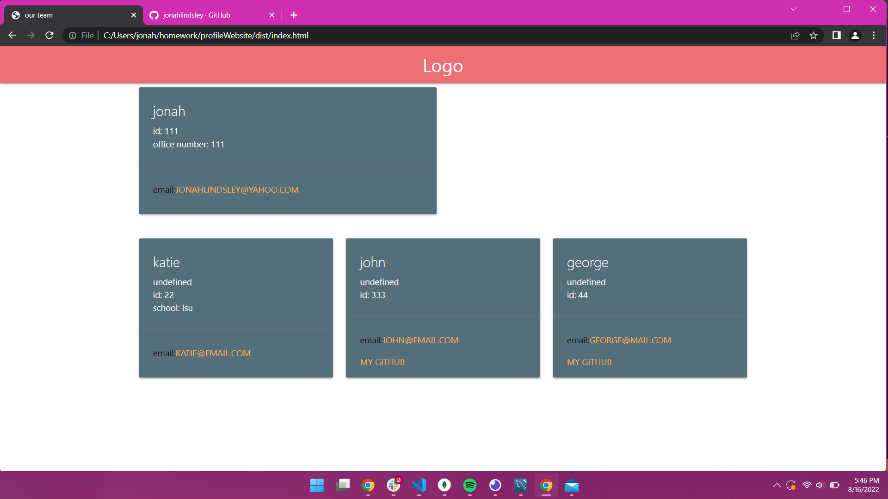

# 10 Object-Oriented Programming: Team Profile Generator

## Discription

this is the team profile generator i made, uses inquirer and jest to run tests and gather user input. after running the file and inputing the required information it will produce a new styled html page in the dist folder. 
 [walkthrough video link](https://drive.google.com/file/d/1fsBw40GhtLP9k5-TVlDooVhanSiU48oS/view)

  

